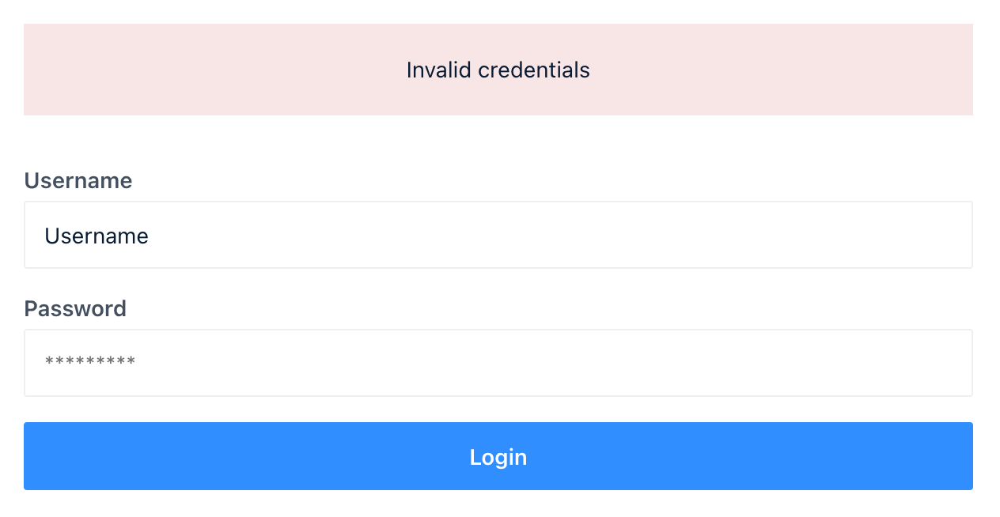

# React Login

In this task we want to see how you would build a simple React app. We already prepared a development setup using Webpack for you. You can start a local development server by running `npm start` inside here. Make sure linting is fine (`npm run lint` to check, `npm run lint-fix` to fix many linting errors automatically) and that tests are fine (`npm test`).

* The file `api.ts` exports two asynchronous functions that mock a very simple API:
    * `login`: When provided a valid username and password (you find two valid user accounts in the same file), then it returns an access token, else it returns `undefined`.
    * `listPosts`: When provided a valid access token (aquired from calling `login`), then it returns a list of posts, else it throws.
    * `retrievePost`: When provided a valid access token (aquired from calling `login`) and a postId, then it returns that post, else it throws.
* General styling values:
    * The primary blue color is `#318EFF`
    * The danger red color is `#F8E6E7`
    * The border color is `#DFE3E0`
    * The font color is `#44505F`
    * Paddings should be from one of the possible values `4px`, `8px`, `12px`, `16px`, `24px`
* Implement three screens:
    * A login screen:
        * The login form should be a single centered block looking like the following screenshot:
          
        * The block should have a max width of `600px`.
        * Responsive, so should work on mobile screen sizes as well.
        * Provides user feedback in case the credentials are invalid.
    * A post list screen:
        * A simple list of the available posts matching the design of the login screen.
        * Responsive, so should work on mobile screen sizes as well.
    * A post details screen:
        * A simple details screen for a post also showing the comments for it.
        * Responsive, so should work on mobile screen sizes as well.
* Use hooks to manage state.
* Don't add any new third party libraries. Use what is already there.
